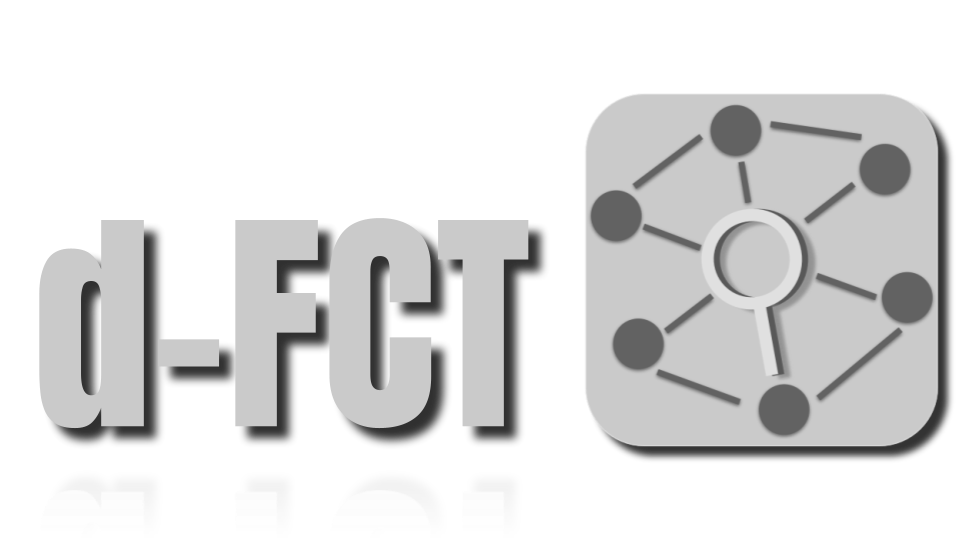
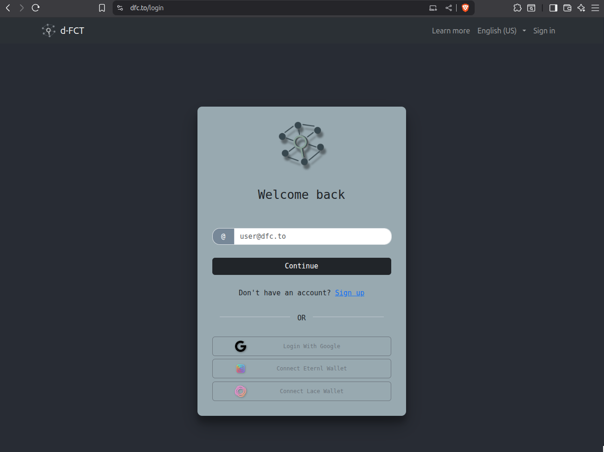
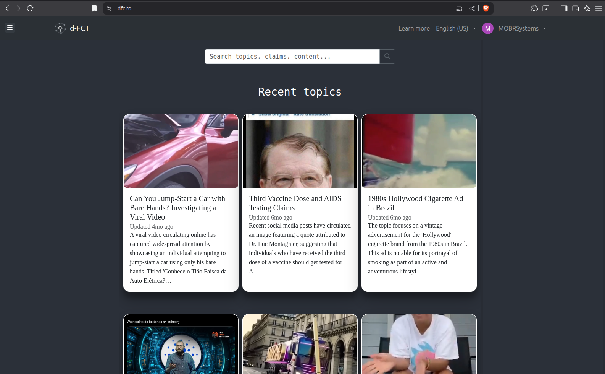
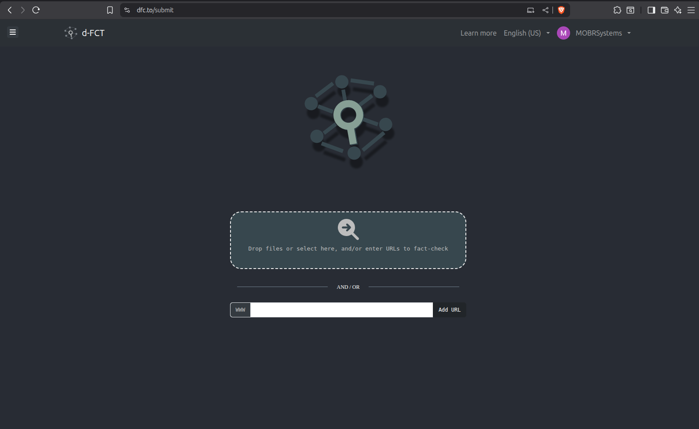
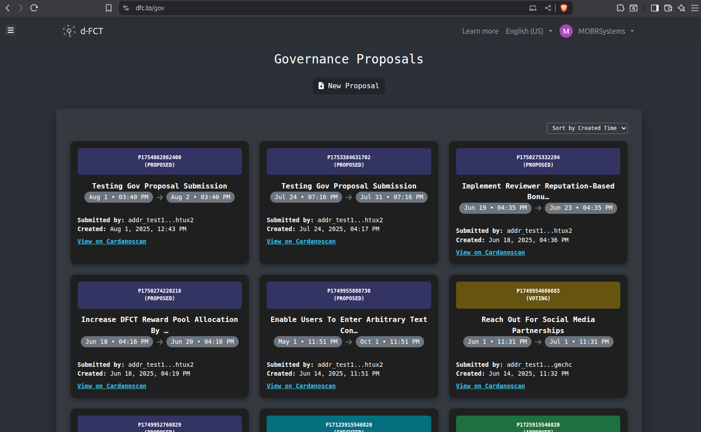
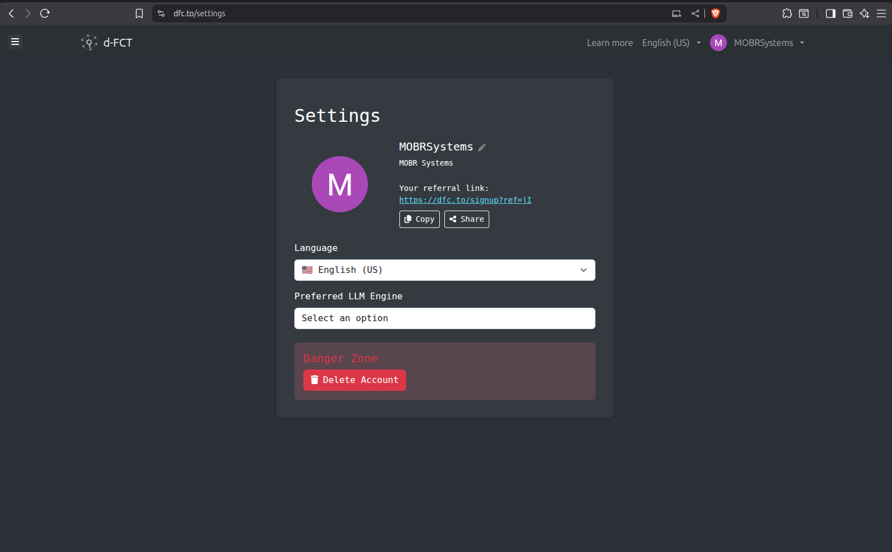

# d-FCT Frontend (ReactJS)

> Web interface for the **Decentralized Fact-Checking Toolkit (d-FCT)**, built with React and Vite.

<p align="center">
  
</p>

---

## Overview

The d-FCT frontend lets users:

- Submit online content (URLs, images, videos, audio, text)
- Generate fact-checking topics
- Inspect extracted claims and evidence
- Interact with governance workflows on the Cardano blockchain

It connects to the d-FCT backend (Python + Flask) and an AI processing pipeline that powers topic extraction, tagging, and verification workflows.

---

## Screenshots

<p align="center">
  <table align="center">
    <tr>
      <td align="center">
        <br/>
        <sub><b>Login</b></sub>
      </td>
      <td align="center">
        <br/>
        <sub><b>Landing / Topics</b></sub>
      </td>
    </tr>
    <tr>
      <td align="center">
        <br/>
        <sub><b>Topic Breakdown</b></sub>
      </td>
      <td align="center">
        <br/>
        <sub><b>Content Submission</b></sub>
      </td>
    </tr>
    <tr>
      <td align="center">
        <br/>
        <sub><b>Governance · Proposals</b></sub>
      </td>
      <td align="center">
        <br/>
        <sub><b>Settings</b></sub>
      </td>
    </tr>
  </table>
</p>

---

## Features

### Core UX

- Topic discovery page with search and language filters (e.g., `en`, `pt-BR`)
- Topic submission flow that accepts:
  - Files (images, video, audio, documents)
  - URLs (news articles, social media posts, etc.)
  - Additional context text
- Topic breakdown page with:
  - Content carousel (images/videos)
  - Extracted claims
  - Pro/contra evidence and AI-generated tags

### Authentication & Accounts

- Email/password authentication with confirmation flow (backend) and login/register UI
- Google OAuth login with avatar and display name

### Fact-Checking Flow

- Asynchronous processing of uploaded files and URLs
- Polling task status and showing progress to the user
- Support for multiple content types (text, image, video, audio)
- URL scrapers for social media and generic websites (handled by backend)

### Cardano & Governance

- Cardano wallet login (CIP-30) and transaction building via embedded **Lucid** library (`src/lib/lucid`)
- Governance page to:
  - Create and update proposals
  - Encode datums and redeemers
  - Interact with on-chain validators

### Internationalization

- i18n with `i18next`
- JSON translation files in:
  - `src/locales/en/translation.json`
  - `src/locales/pt/translation.json`

---

## Tech Stack

- **Frontend**
  - React 18
  - Vite (`vite.config.mjs`)
  - React Router (`RouterProvider`, nested routes)
  - React Bootstrap (toasts, layout)
  - Custom CSS modules in `src/styles/*.css`
- **Internationalization**
  - `i18next` + `react-i18next`
- **Cardano / Web3**
  - Embedded **Lucid** library in `src/lib/lucid`
  - Frontend helpers in `src/chains/cardano/*`:
    - Wallet utils
    - Transaction builders
    - Governance datums/redeemers
- **Backend (external project)**
  - Python + Flask API
  - SQLAlchemy + PostgreSQL
  - Celery for async tasks
  - AWS S3 for content storage

---

## Project Structure

> Only key folders and files are highlighted here.

```text
dfct-frontend/
├── public/
│   ├── favicon.ico / favicon.png
│   ├── logo192.png / logo512.png / logo512-wide.png
│   ├── manifest.json / robots.txt
│   └── screenshots/
├── src/
│   ├── index.jsx
│   ├── i18n.jsx
│   ├── styles/               # Global + page-specific CSS
│   ├── components/           # Reusable UI and modals
│   │   ├── topic/            # Topic list, toolbar, sidebar, etc.
│   │   ├── wallet/           # Cardano wallet login
│   │   └── ...
│   ├── hooks/                # Hooks (auth, uploads, etc.)
│   ├── locales/              # en/pt translations
│   ├── chains/
│   │   └── cardano/          # Lucid integration, tx builders, datums
│   ├── lib/
│   │   └── lucid/            # Lucid vendored bundle
│   ├── LandingPage.jsx
│   ├── TopicSubmissionPage.jsx
│   ├── TopicBreakdownPage.jsx
│   ├── GovernancePage.jsx
│   ├── SettingsPage.jsx
│   ├── AuthPage.jsx
│   ├── WaitingListPage.jsx
│   ├── LoadingPage.jsx
│   └── ErrorPage.jsx
├── vite.config.mjs
├── index.html
├── package.json
└── README.md
```

---

## Getting Started

### 1. Prerequisites

* Node.js (LTS recommended)
* npm or yarn
* d-FCT backend running and accessible (same origin or via proxy)

---

### 2. Installation

```bash
# Clone the repository
git clone https://github.com/mobr-ai/dFCT-frontend.git
cd dFCT-frontend

# Install dependencies
npm install
# or
yarn install
```

---

### 3. Development

Start the Vite dev server:

```bash
npm run dev
# or
yarn dev
```

By default, the app will be available at:

* `http://localhost:5173` (Vite default)
  or whatever port you configure.

You will typically need to configure environment variables (e.g. backend URL, API keys) in a `.env` or `.env.local` file, depending on how the project is set up.

---

### 4. Production Build

Build and preview the production bundle:

```bash
npm run build
npm run preview   # optional: preview the built bundle locally
```

The build output will be placed in the `dist/` folder, ready to be served by a static file server or integrated with the d-FCT backend.

---

### 5. Tests

This project includes basic tests (for example, `LandingPage.test.jsx`). Run:

```bash
npm test
# or
yarn test
```

---

## Internationalization

Translations live in:

* `src/locales/en/translation.json`
* `src/locales/pt/translation.json`

To add a new text:

1. Add a key in both JSON files (`en` and `pt`).
2. Use `useTranslation()` from `react-i18next` in your components and call `t("your.key")`.
3. Keep keys stable over time to avoid breaking existing translations.

---

## Cardano & Lucid Integration

Cardano functionality is implemented in `src/chains/cardano/*` using the embedded **Lucid** library. It handles:

* Connecting to CIP-30 wallets (Lace, Nami, Eternl, Flint, etc.)
* Building and signing transactions for:

  * Publishing topics to on-chain contracts
  * Submitting governance proposals and updates
* Encoding Plutus data (datums/redeemers) using `Data.to(...)`
* Applying parameters to scripts (e.g. governance contracts, topic validators)

The vendored Lucid bundle lives in `src/lib/lucid`, including WASM modules for core serialization and message signing.

---

## Backend Integration

The frontend expects a d-FCT backend that exposes endpoints for:

* User registration, login, Google OAuth, and JWT issuance
* Topic CRUD and listing:

  * All topics
  * Topics by user
  * Search and filtering
  * Related topics
* Asynchronous processing of content:

  * `/process`, `/process_evidence`, etc.
  * Task IDs that can be polled to check progress
* S3 pre-signed uploads for direct client-side file uploads

Backends typically live in a separate repository (e.g., `dfct-backend`) and must be configured to share CORS/origin as needed.

---

## Contributing

* Open issues for bugs, UX suggestions, or feature requests.
* Use small, focused pull requests and include screenshots when UI changes.
* Keep translations updated (at least `en` and `pt`).
* When touching governance / Cardano-related code, ensure:

  * Datum/redeemer structures remain compatible with on-chain validators.
  * Any changes in Lucid data schemas are reflected consistently across the frontend.

---

## License

Licensing details will be documented in a dedicated `LICENSE` file.

If you are using or extending this code, please open an issue or contact the maintainers to clarify licensing and contribution guidelines.
