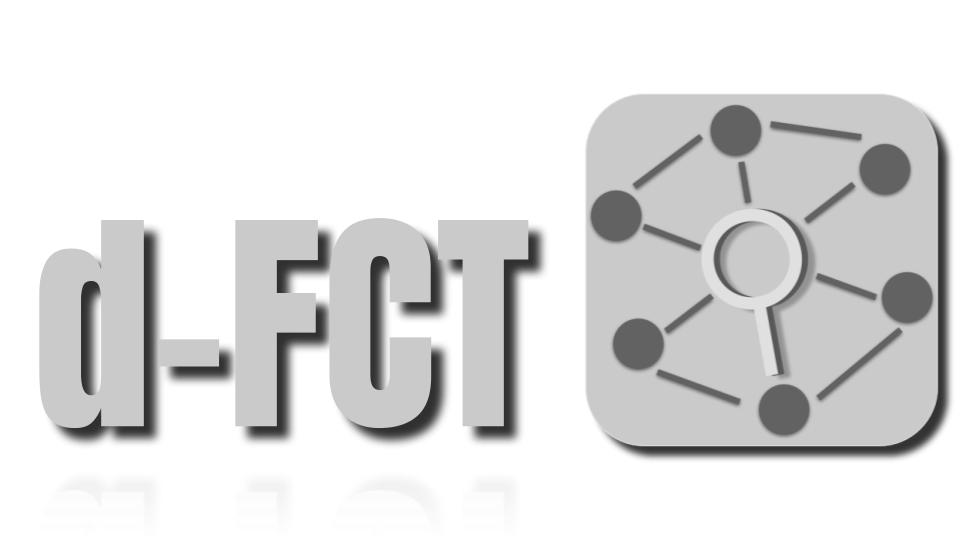
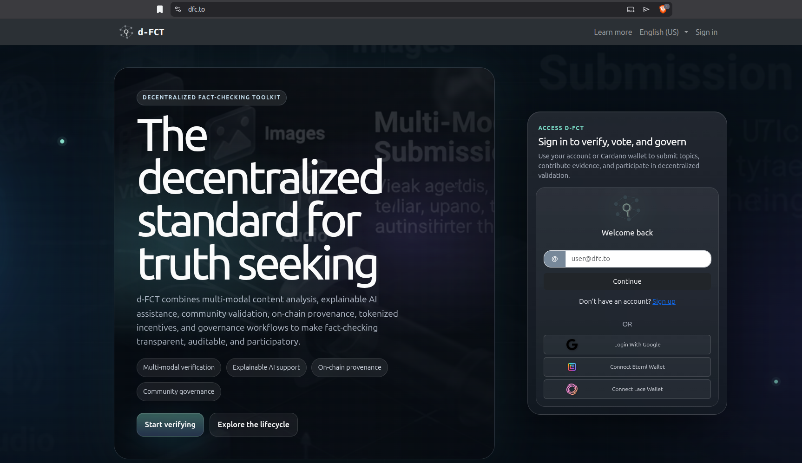
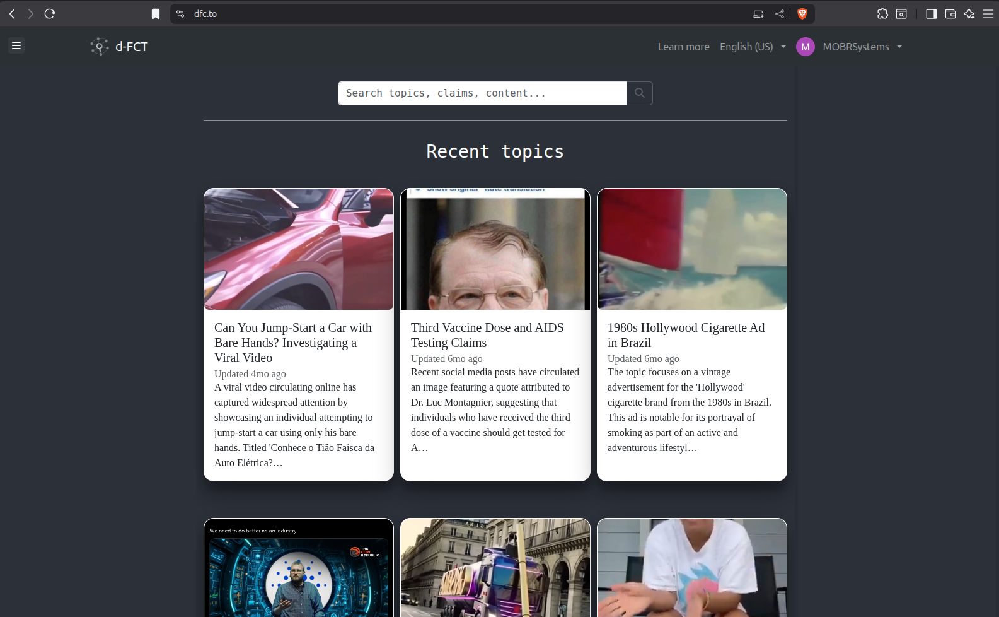
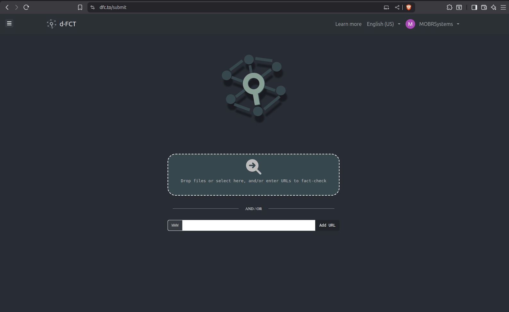
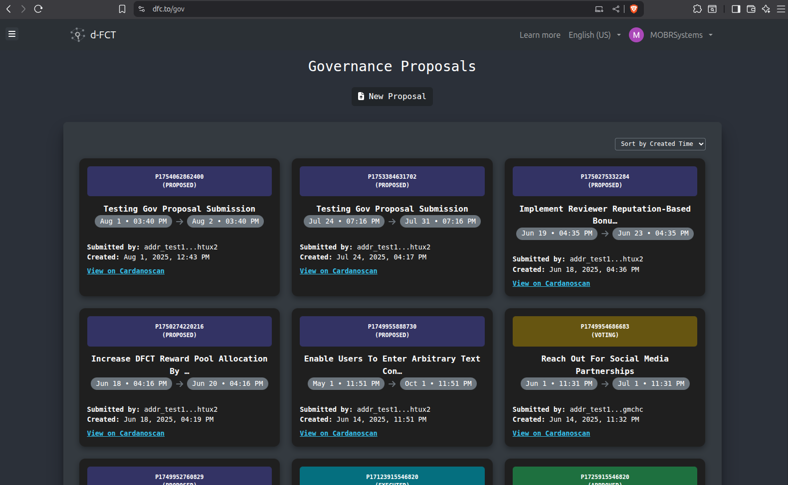
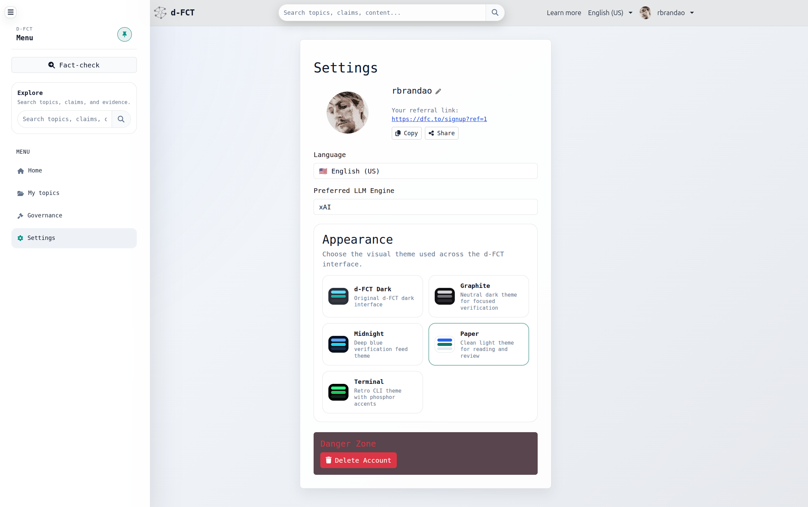

# d-FCT Frontend (ReactJS)

> Web interface for the **Decentralized Fact-Checking Toolkit (d-FCT)**, built with React and Vite.

<p align="center">
  
</p>

<p align="center">
  <b>Decentralized fact-checking, AI-assisted claim review, and Cardano-powered governance.</b>
</p>

<p align="center">
  <a href="https://dfc.to">dfc.to</a>
  ·
  <a href="#features">Features</a>
  ·
  <a href="#getting-started">Getting Started</a>
  ·
  <a href="#cardano--lucid-integration">Cardano</a>
</p>

<p align="center">
  
  
  
  
  <a href="./LICENSE">
    
  </a>
</p>

---

## Overview

The d-FCT frontend lets users:

- Submit online content (URLs, images, videos, audio, text)
- Generate fact-checking topics
- Inspect extracted claims and evidence
- Review topic status, tags, references, and related topics
- Interact with governance workflows on the Cardano blockchain
- Sign in with email/password, Google OAuth, or Cardano wallet flows
- Navigate a redesigned topic feed with search, filters, and selectable themes

It connects to the d-FCT backend (Python + Flask) and an AI processing pipeline that powers topic extraction, tagging, evidence review, and verification workflows.

The app is currently structured as a Vite-powered React SPA with public landing pages, authenticated topic workflows, Cardano governance pages, user settings, and API-prefixed backend integration.

---

## Screenshots

<p align="center">
  <table align="center">
    <tr>
      <td align="center">
        <br/>
        <sub><b>Login</b></sub>
      </td>
      <td align="center">
        <br/>
        <sub><b>Landing / Topic Feed</b></sub>
      </td>
    </tr>
    <tr>
      <td align="center">
        <br/>
        <sub><b>Topic Breakdown</b></sub>
      </td>
      <td align="center">
        <br/>
        <sub><b>Content Submission</b></sub>
      </td>
    </tr>
    <tr>
      <td align="center">
        <br/>
        <sub><b>Governance · Proposals</b></sub>
      </td>
      <td align="center">
        <br/>
        <sub><b>Settings / Themes</b></sub>
      </td>
    </tr>
  </table>
</p>

---

## Features

### Core UX

- Public welcome page for first-time visitors
- Revamped topic discovery feed with:
  - Topic cards optimized for richer browsing
  - Global topic search
  - Recent topics and feed layout improvements
  - Better loading and empty states
  - Correct elapsed-time display, including topics older than one year

- Topic discovery page with search and language filters (e.g., `en`, `pt-BR`)
- Separate topic views for:
  - All topics (`/topics`)
  - User topics (`/mytopics`)

- Topic submission flow that accepts:
  - Files (images, video, audio, documents)
  - URLs (news articles, social media posts, etc.)
  - Additional context text

- Topic breakdown page with:
  - Content carousel and content list
  - Extracted claims
  - Pro/contra evidence and AI-generated tags
  - Topic toolbar actions
  - Share modal
  - Related topic discovery

### Authentication & Accounts

- Email/password authentication with confirmation flow (backend) and login/register UI
- Google OAuth login with avatar and display name
- Cardano wallet login flow using signed wallet challenges
- Account settings page with:
  - Username updates
  - Avatar upload
  - Language configuration
  - Theme selection
  - Account deletion danger zone

- Waitlist/signup page integrated with the API-prefixed backend route

### Fact-Checking Flow

- Asynchronous processing of uploaded files and URLs
- Polling task status and showing progress to the user
- Support for multiple content types (text, image, video, audio)
- URL metadata loading and URL card previews
- Direct client-side uploads through S3 pre-signed posts
- Evidence submission modal for adding pro/con evidence to existing claims
- URL scrapers for social media and generic websites (handled by backend)
- API error normalization and safer session-expiration handling

### Cardano & Governance

- Cardano wallet login (CIP-30) and transaction building via embedded **Lucid** library (`src/lib/lucid`)
- Signed wallet challenge flow for wallet-based authentication
- Governance page to:
  - List governance proposals
  - Create new proposals
  - Validate proposal inputs
  - Configure authorized payment key hashes
  - Configure minimum voting tokens
  - Configure voting periods
  - Estimate and submit transactions

- Proposal detail page (`/proposal/:proposalId`) to:
  - Inspect proposal status and on-chain metadata
  - Cast votes
  - Finalize proposals
  - Execute proposal actions
  - Update proposal parameters when allowed

- Cardano explorer links for submitted transactions
- Hardened wallet/proposal flows and safer modal behavior

### Themes & Interface Polish

- User-selectable theme system with persisted preferences
- Theme selector available from Settings
- Current theme families include:
  - d-FCT Dark
  - Paper
  - Graphite
  - Midnight
  - Terminal

- Shared design tokens in `src/styles/theme-tokens.css`
- Route-level theme synchronization through `src/theme/themeStorage.js`
- Theme overrides for feed cards, search, governance, proposals, modals, submission, topic breakdown, scrollbars, and video placeholders
- Updated navigation bar and sidebar styling
- Animated brand component for improved visual identity

### Internationalization

- i18n with `i18next`
- Browser language detection through `i18next-browser-languagedetector`
- JSON translation files in:
  - `src/locales/en/translation.json`
  - `src/locales/pt/translation.json`

- English and Brazilian Portuguese translations for:
  - Authentication
  - Topic submission
  - Topic review
  - Governance
  - Wallet flows
  - Settings
  - Themes
  - Waitlist
  - Status labels

---

## Tech Stack

- **Frontend**
  - React 18
  - Vite (`vite.config.mjs`)
  - React Router (`createBrowserRouter`, `RouterProvider`, nested routes)
  - React Bootstrap (toasts, layout, modals, forms)
  - React Burger Menu (mobile/sidebar navigation)
  - Styled Components
  - Custom CSS in `src/styles/*`
  - Theme tokens and route-level theme persistence

- **Internationalization**
  - `i18next`
  - `react-i18next`
  - `i18next-browser-languagedetector`

- **Authentication**
  - Email/password auth UI
  - Google OAuth via `@react-oauth/google`
  - Cardano wallet challenge signing

- **Uploads**
  - `react-dropzone`
  - `spark-md5` for file hashing
  - S3 pre-signed upload integration

- **Cardano / Web3**
  - Embedded **Lucid** library in `src/lib/lucid`
  - `@emurgo/cardano-serialization-lib-browser`
  - Frontend helpers in `src/chains/cardano/*`:
    - Wallet utilities
    - Transaction builders
    - Governance datums/redeemers
    - Proposal update helpers
    - Topic publication helpers

- **Build & Tooling**
  - Vite 6
  - WASM support via `vite-plugin-wasm`
  - Top-level await support via `vite-plugin-top-level-await`
  - Optional bundle compression via `vite-plugin-compression`

- **Backend (external project)**
  - Python + Flask API
  - SQLAlchemy + PostgreSQL
  - Celery for async tasks
  - AWS S3 for content storage
  - Cardano transaction coordination and API-prefixed routes

---

## Project Structure

> Only key folders and files are highlighted here.

```text
dfct-frontend/
├── public/
│   ├── favicon.ico / favicon.png
│   ├── logo192.png / logo512.png / logo512-wide.png
│   ├── logo-share-1200x630.jpg
│   ├── manifest.json / robots.txt
│   └── screenshots/
├── scripts/
│   └── smoke-local.sh                 # Local frontend smoke checks
├── .github/
│   └── workflows/
│       └── frontend-smoke.yml         # CI smoke workflow
├── src/
│   ├── index.jsx                      # Router, layout, auth/session bootstrap
│   ├── i18n.jsx                       # i18next setup
│   ├── styles/                        # Global + page-specific CSS
│   │   ├── landing/                   # Feed layout/card styles
│   │   ├── search/                    # Global topic search styles
│   │   ├── themes/base/               # Theme hardening and page overrides
│   │   ├── theme-tokens.css
│   │   └── theme-overrides.css
│   ├── theme/
│   │   ├── themes.js                  # Theme definitions
│   │   └── themeStorage.js            # Persisted theme + route sync
│   ├── components/                    # Reusable UI and modals
│   │   ├── branding/
│   │   │   └── AnimatedBrand.jsx
│   │   ├── search/
│   │   │   └── GlobalTopicSearch.jsx
│   │   ├── settings/
│   │   │   └── ThemeSelector.jsx
│   │   ├── topic/                     # Topic list, toolbar, sidebar, publish modal
│   │   ├── wallet/                    # Cardano wallet login
│   │   └── ...
│   ├── hooks/                         # Auth, uploads, click-outside, reveal-on-scroll
│   ├── helpers/                       # Image resizing and helper utilities
│   ├── locales/                       # en/pt translations
│   ├── chains/
│   │   └── cardano/                   # Lucid integration, tx builders, datums
│   ├── lib/
│   │   └── lucid/                     # Lucid vendored bundle
│   ├── WelcomePage.jsx
│   ├── LandingPage.jsx
│   ├── TopicSubmissionPage.jsx
│   ├── TopicBreakdownPage.jsx
│   ├── GovernancePage.jsx
│   ├── ProposalPage.jsx
│   ├── SettingsPage.jsx
│   ├── AuthPage.jsx
│   ├── WaitingListPage.jsx
│   ├── LoadingPage.jsx
│   └── ErrorPage.jsx
├── vite.config.mjs
├── index.html
├── package.json
└── README.md
```

---

## Getting Started

### 1. Prerequisites

- Node.js LTS recommended
- npm
- d-FCT backend running and accessible (same origin or via proxy)
- A configured Google OAuth client ID if testing Google login
- A CIP-30 compatible Cardano wallet if testing wallet login and governance flows

---

### 2. Installation

```bash
# Clone the repository
git clone https://github.com/mobr-ai/dfct-frontend.git
cd dfct-frontend

# Install dependencies
npm install
```

---

### 3. Development

Start the Vite dev server:

```bash
npm run dev
```

By default, the app will be available at:

- `http://localhost:5173` (Vite default)
  or whatever port you configure.

You will typically need to configure environment variables in a `.env` or `.env.local` file.

Common frontend environment values include:

```bash
VITE_GOOGLE_CLIENT_ID=your-google-client-id
```

Depending on the deployment mode, the frontend can call the backend through the same origin or through a configured Vite/backend proxy.

Main routes include:

```text
/                         Public welcome / home
/topics                   Public or authenticated topic feed
/mytopics                 User topics
/settings                 User settings and theme selector
/gov                      Governance proposals
/proposal/:proposalId     Proposal detail page
/signup                   Waitlist signup
/signup_disabled          Disabled direct registration page
/login                    Login page
/submit                   Topic submission
/t/:userId/:topicId       Topic breakdown/share page
```

---

### 4. Production Build

Build and preview the production bundle:

```bash
npm run build
npm run preview   # optional: preview the built bundle locally
```

The build output will be placed in the `dist/` folder, ready to be served by a static file server or integrated with the d-FCT backend.

---

### 5. Tests

This project currently exposes the following npm scripts:

```bash
npm run dev
npm run build
npm run preview
```

For local verification, run the frontend smoke checks:

```bash
bash scripts/smoke-local.sh
```

The smoke script checks common frontend regressions, including:

- Sensitive or ungated debug logs
- Required API-prefixed route usage
- Translation and i18n consistency
- Build readiness checks
- Frontend workflow assumptions used by CI

The repository also includes a GitHub Actions workflow for smoke checks:

```text
.github/workflows/frontend-smoke.yml
```

There are Testing Library setup files and an existing `LandingPage.test.jsx`, but no dedicated `npm test` script is currently declared in `package.json`.

---

## Internationalization

Translations live in:

- `src/locales/en/translation.json`
- `src/locales/pt/translation.json`

To add a new text:

1. Add a key in both JSON files (`en` and `pt`).
2. Use `useTranslation()` from `react-i18next` in your components and call `t("your.key")`.
3. Keep keys stable over time to avoid breaking existing translations.
4. Keep user-facing strings synchronized across both languages whenever UI behavior changes.
5. Run the smoke script after translation changes:

```bash
bash scripts/smoke-local.sh
```

The app currently includes translations for authentication, topic submission, topic status labels, evidence review, governance proposals, Cardano wallet flows, settings, themes, waitlist, and sharing.

---

## Cardano & Lucid Integration

Cardano functionality is implemented in `src/chains/cardano/*` using the embedded **Lucid** library. It handles:

- Connecting to CIP-30 wallets (Lace, Nami, Eternl, Flint, etc.)

- Signed wallet challenge login

- Loading Cardano serialization modules

- Fetching Cardano/network parameters

- Building and signing transactions for:
  - Publishing topics to on-chain contracts
  - Submitting governance proposals
  - Updating proposal parameters
  - Casting votes
  - Finalizing proposal workflows
  - Executing governance actions

- Encoding Plutus data (datums/redeemers) using `Data.to(...)`

- Applying parameters to scripts (e.g. governance contracts, topic validators)

- Displaying submitted transaction links through the configured Cardano explorer

The vendored Lucid bundle lives in `src/lib/lucid`, including WASM modules for core serialization and message signing.

Key Cardano/frontend files include:

```text
src/chains/cardano/buildTopicTx.js
src/chains/cardano/buildProposalTx.js
src/chains/cardano/buildProposalUpdateTx.js
src/chains/cardano/prepareTopicDatum.js
src/chains/cardano/prepareProposalDatum.js
src/chains/cardano/prepareProposalRedeemer.js
src/chains/cardano/prepareProposalUpdateDatum.js
src/chains/cardano/signAndSubmitTx.js
src/chains/cardano/useLucidClient.js
src/chains/cardano/useProposalUpdater.js
src/chains/cardano/walletUtils.js
src/components/wallet/CardanoWalletLogin.jsx
```

---

## Backend Integration

The frontend expects a d-FCT backend that exposes API-prefixed endpoints for:

- User registration, login, Google OAuth, confirmation, and JWT issuance

- Session-aware authenticated requests

- Topic CRUD and listing:
  - All topics
  - Topics by user
  - Public topic reads
  - Search and filtering
  - Related topics
  - Topic deletion where permitted

- Asynchronous processing of content:
  - `/api/process`
  - `/api/process_evidence`
  - `/api/check`

- URL metadata and content fetching:
  - `/api/fetch_url`

- S3 pre-signed uploads for direct client-side file uploads:
  - `/api/sign_s3`

- Governance and proposal APIs:
  - Proposal listing
  - Proposal detail reads
  - Proposal submission
  - Proposal status sync
  - Proposal verification and update flows

- Waitlist signup:
  - API-prefixed waitlist endpoint used by `WaitingListPage.jsx`

Backends typically live in a separate repository (e.g., `dfct-backend`) and must be configured to share CORS/origin as needed.

The frontend has been aligned with hardened backend routes, so legacy non-API-prefixed calls such as `/process`, `/process_evidence`, `/check`, or `/sign_s3` should not be reintroduced.

---

## Contributing

- Open issues for bugs, UX suggestions, or feature requests.
- Use small, focused pull requests and include screenshots when UI changes.
- Keep translations updated in both `en` and `pt`.
- Run the local smoke script before opening or merging frontend changes:

```bash
bash scripts/smoke-local.sh
```

- Run a production build before shipping UI or routing changes:

```bash
npm run build
```

- When touching authentication or backend integration code, ensure:
  - API routes remain prefixed with `/api`
  - Auth/session errors are handled safely
  - Sensitive debug logs are not committed
  - Development-only logs are gated behind `import.meta.env.DEV`

- When touching governance / Cardano-related code, ensure:
  - Datum/redeemer structures remain compatible with on-chain validators.
  - Any changes in Lucid data schemas are reflected consistently across the frontend.
  - Wallet challenge signing and proposal flows remain stable.
  - Transaction links and submitted hashes are surfaced clearly to users.

- When touching themes or shared UI styles, ensure:
  - Theme tokens remain centralized.
  - New user-facing text is translated in both English and Portuguese.
  - Dark and light theme variants remain readable.
  - Governance, modals, topic cards, submission, and settings pages are checked across themes.

---

## License

[](./LICENSE)

This project is licensed under the **MIT License**.
See the **[LICENSE](./LICENSE)** file for the full text.

© 2025 MOBR Systems LTDA.
